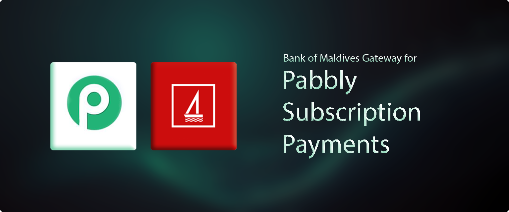
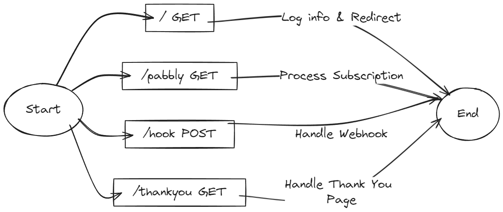

# Bank of Maldives Gateway for Pabbly Subscription Payments

Lets [Pabbly Subscription Billing](https://www.pabbly.com/subscription-billing/) take payments
through [Bank of Maldives](https://www.bankofmaldives.com.mv/) Connect. Pabbly sends a customer to
this app, it opens a BML transaction, and on success it records the payment back against the Pabbly
invoice and forwards the customer to wherever that product is configured to land.


## Routes



| Route | Method | Purpose |
|---|---|---|
| `/pabbly` | GET | Entry point. Takes a `hostedpage` id, opens a BML transaction, redirects to BML's payment URL. |
| `/hook` | POST | BML's webhook. Re-checks the transaction with BML, then records the payment. |
| `/thankyou` | GET | Where BML returns the customer. Verifies the payment, records it, redirects onward. |
| `/health` | GET | Liveness probe. Returns `{"status": "ok"}` and logs nothing. |
| `/` | GET | Logs the request to Telegram and redirects to `DEFAULT_REDIRECT_URL`. |

`/hook` and `/thankyou` both confirm state directly with BML rather than trusting the incoming
parameters, and recording is idempotent — an invoice already marked paid is never charged twice.

## Environment variables

All are required; the app refuses to start if any is missing. Locally, copy
[`.env.example`](.env.example) to `.env` and fill it in.

| Variable | Value |
|---|---|
| `BML_API_KEY` | From the BML Merchant portal — see [bml-connect](https://github.com/bankofmaldives/bml-connect). |
| `PABBLY_USERNAME` | Pabbly API username — see the [Pabbly API docs](https://www.apidocs.pabbly.com/). |
| `PABBLY_PASSWORD` | Pabbly API password. |
| `DOMAIN` | Public URL of this app, e.g. `https://pay.example.com`. Used to build BML's return URL. |
| `DEFAULT_REDIRECT_URL` | Fallback destination when a product has no redirect configured. |
| `TELEGRAM_BOT_TOKEN` | Bot token from [@BotFather](https://t.me/botfather); all errors are sent here. |
| `TELEGRAM_CHAT_ID` | Chat or channel id from [@jsondumpbot](https://t.me/jsondumpbot). |

## Deploy

Ships with a [`Dockerfile`](Dockerfile) and [`railway.json`](railway.json), so
[Railway](https://railway.com) needs no extra configuration. Point a new service at this repo from
[railway.com/new](https://railway.com/new) and it builds the Dockerfile and redeploys on every push
to your default branch.

Then set the variables above in the service's **Variables** tab, generate a domain under
**Settings → Networking**, and set `DOMAIN` to that URL.

The container listens on `$PORT` and runs as a non-root user. It runs anywhere Docker does —
Railway is just what's wired up out of the box.

Healthchecks go to `/health`, which is already set in [`railway.json`](railway.json). Do not point
one at `/` — that route reports every request to Telegram.

### Wiring it up

Once the app has a public URL, two things point at it:

- **Pabbly** sends customers to `https://<your-domain>/pabbly?hostedpage=<hosted page id>`
- **BML** merchant webhook points at `https://<your-domain>/hook`

The BML return URL is not configured anywhere — the app builds it from `DOMAIN` when it opens each
transaction, which is why that variable has to match your real public URL.

## Development

Dependencies are managed with [uv](https://docs.astral.sh/uv/):

```bash
curl -LsSf https://astral.sh/uv/install.sh | sh
```

```bash
uv sync              # install locked dependencies
uv run pytest        # tests
uv run ruff check .  # lint
uv run ruff format . # format
uv run pyright       # type check
```

Run it locally with `uv run flask --app app run --debug`, or exactly as it runs in production with
`uv run gunicorn --config gunicorn_config.py app:app`.

## Errors

Everything is reported to the Telegram chat you configure. If nothing arrives, check the service's
**Deployments → Logs** in the Railway dashboard.

## License

[MIT](LICENSE)
